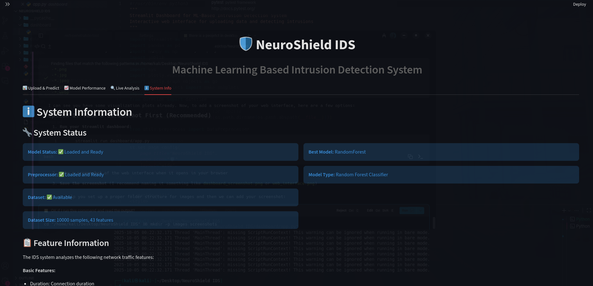
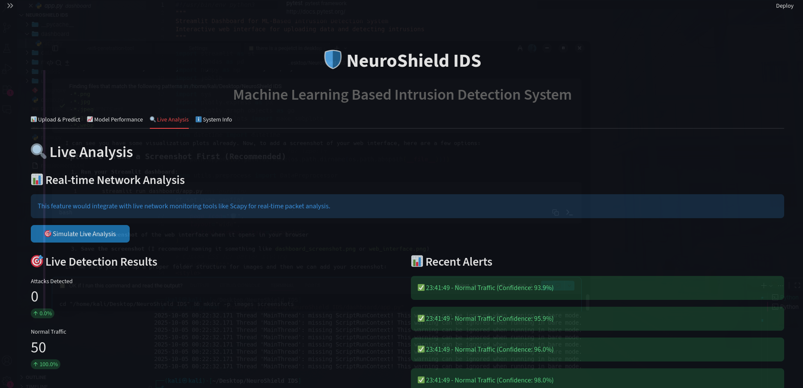
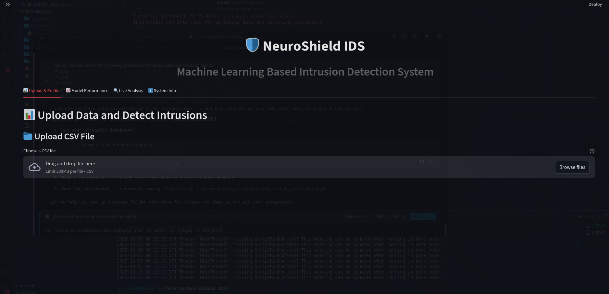

# 🛡️ NeuroShield IDS - ML-Based Intrusion Detection System

A comprehensive Machine Learning-based Intrusion Detection System (IDS) built with Python, featuring multiple ML algorithms, data preprocessing, and an interactive Streamlit dashboard.

## 📋 Table of Contents

- [Features](#features)
- [Project Structure](#project-structure)
- [Installation](#installation)
- [Usage](#usage)
- [System Performance](#system-performance)
- [Dashboard Features](#dashboard-features)
- [Technical Details](#technical-details)

## ✨ Features

- **Multiple ML Models**: Random Forest, Decision Tree, and SVM classifiers
- **Comprehensive Preprocessing**: Data cleaning, categorical encoding, and normalization
- **High Performance**: 99.55% accuracy on test data
- **Interactive Dashboard**: Streamlit-based web interface
- **Real-time Analysis**: Live network traffic analysis simulation
- **Model Comparison**: Performance metrics and visualizations
- **Feature Importance**: Analysis of most important features
- **Export Capabilities**: Download prediction results

## 📁 Project Structure

```
NeuroShield IDS/
├── main.py                 # Main entry point
├── requirements.txt        # Python dependencies
├── generate_dataset.py     # Synthetic dataset generator
├── README.md              # This file
├── data/
│   └── sample_dataset.csv # Training/test dataset (10,000 samples)
├── model/
│   └── train_model.py     # ML model training module
├── utils/
│   └── preprocess.py      # Data preprocessing utilities
├── dashboard/
│   └── app.py             # Streamlit dashboard
├── images/                # Web interface screenshots
│   ├── dashboard_main.png
│   ├── upload_predict.png
│   ├── model_performance.png
│   └── live_analysis.png
└── models/
    ├── ids_model.pkl      # Best trained model
    ├── preprocessor.pkl   # Data preprocessor
    ├── model_metadata.pkl # Model information
    ├── randomforest_model.pkl
    ├── decisiontree_model.pkl
    ├── svm_model.pkl
    └── plots/             # Evaluation visualizations
        ├── model_comparison.png
        ├── confusion_matrices.png
        └── feature_importance.png
```

## 🚀 Installation

1. **Clone or download the project**
2. **Install dependencies**:
   ```bash
   pip install -r requirements.txt
   ```

3. **Verify installation**:
   ```bash
   python3 main.py --info
   ```

## 💻 Usage

### 1. Training the Model

Train the complete IDS system with the synthetic dataset:

```bash
python3 main.py --train
```

This will:
- Load and preprocess the dataset
- Train multiple ML models (Random Forest, Decision Tree, SVM)
- Perform hyperparameter tuning
- Evaluate and select the best model
- Save models and generate evaluation plots

### 2. Testing the System

Test the trained model:

```bash
python3 main.py --test
```

### 3. System Information

Check system status and model information:

```bash
python3 main.py --info
```

### 4. Interactive Dashboard

Launch the Streamlit dashboard:

```bash
streamlit run dashboard/app.py
```

Then open your browser to `http://localhost:8501`

## 📊 System Performance

The trained system achieves excellent performance:

- **Accuracy**: 99.55%
- **Precision**: 99.55%
- **Recall**: 99.55%
- **F1-Score**: 99.55%

### Confusion Matrix:
```
                Predicted
Actual    Normal  Attack
Normal    7926    3
Attack    42      2029
```

### Dataset Statistics:
- **Total Samples**: 10,000
- **Features**: 41
- **Attack Ratio**: 20.71%
- **Attack Types**: DoS, Probe, R2L, U2R

## 🎨 Dashboard Features

### 1. Upload & Predict Tab
- Upload CSV files with network traffic data
- Real-time intrusion detection
- Download prediction results
- Individual prediction confidence scores

### 2. Model Performance Tab
- Model comparison charts
- Confusion matrices
- Feature importance analysis
- Performance metrics visualization

### 3. Live Analysis Tab
- Simulated real-time network monitoring
- Live attack detection alerts
- Traffic pattern analysis

### 4. System Info Tab
- System status and health
- Model information
- Usage instructions
- Feature documentation

## 📸 Web Interface Screenshots

### Main Dashboard

*Main dashboard showing upload functionality and system overview*

### Upload & Predict Interface

*Upload CSV files and get real-time intrusion detection predictions*

### Model Performance Visualization

*Compare different ML models with detailed performance metrics*

### Live Analysis Monitoring

*Real-time network traffic monitoring and threat detection*

## 🔧 Technical Details

### Machine Learning Pipeline

1. **Data Preprocessing**:
   - Categorical encoding (LabelEncoder)
   - Feature normalization (StandardScaler)
   - Missing value handling
   - Outlier detection

2. **Model Training**:
   - Random Forest Classifier (Best Model)
   - Decision Tree Classifier
   - Support Vector Machine
   - Hyperparameter tuning with GridSearchCV

3. **Feature Engineering**:
   - 41 network traffic features
   - Basic connection features (duration, protocol, service)
   - Traffic statistics (bytes, counts, rates)
   - Host-based features (logins, file access)
   - Time-based features (connection patterns)

### Dataset Format

The system expects CSV files with the following structure:

| Feature | Description | Type |
|---------|-------------|------|
| duration | Connection duration | float |
| protocol_type | TCP/UDP/ICMP | categorical |
| service | Network service | categorical |
| flag | Connection flag | categorical |
| src_bytes | Source bytes | int |
| dst_bytes | Destination bytes | int |
| ... | ... | ... |
| attack_type | Attack category | categorical |
| is_attack | Binary target (0/1) | int |

### Model Architecture

**Best Model: Random Forest**
- **Estimators**: 100 trees
- **Max Depth**: 10
- **Features**: 41 normalized features
- **Cross-validation**: 5-fold
- **Scoring**: F1-weighted

## 🔒 Cybersecurity Applications

### For Bug Bounty Hunters
- **Traffic Analysis**: Upload network captures to identify suspicious patterns
- **Attack Detection**: Automatically detect DoS, Probe, and other attack types
- **Vulnerability Research**: Use ML insights to understand attack vectors

### For Ethical Hackers
- **Red Team Operations**: Simulate attacks and measure detection capabilities
- **Penetration Testing**: Validate security controls and monitoring systems
- **Threat Modeling**: Understand how ML can enhance security postures

### For Security Researchers
- **Attack Pattern Analysis**: Study different attack methodologies
- **Model Comparison**: Evaluate different ML approaches for threat detection
- **Feature Engineering**: Understand which network features are most important

### For Blue Team Defenders
- **Incident Response**: Rapid identification of malicious network activity
- **Security Monitoring**: Real-time threat detection and alerting
- **Forensic Analysis**: Post-incident network traffic analysis

## 🛠️ Customization

### Adding New Models

To add new ML models, modify `model/train_model.py`:

```python
# Add to models_config dictionary
'NewModel': YourModelClass(
    param1=value1,
    param2=value2
)
```

### Custom Datasets

To use your own dataset:

1. Ensure CSV format with required columns
2. Update categorical column names in `utils/preprocess.py`
3. Run training: `python3 main.py --train --dataset your_data.csv`

### Dashboard Customization

Modify `dashboard/app.py` to:
- Add new visualization types
- Customize UI styling
- Add new analysis features
- Integrate with external APIs

## 🔍 Troubleshooting

### Common Issues

1. **Import Errors**: Ensure all dependencies are installed
   ```bash
   pip install -r requirements.txt
   ```

2. **Model Not Found**: Train the model first
   ```bash
   python3 main.py --train
   ```

3. **Dashboard Not Loading**: Check if Streamlit is installed
   ```bash
   pip install streamlit
   ```

4. **Memory Issues**: Reduce dataset size or use smaller models

### Performance Optimization

- Use smaller datasets for faster training
- Adjust model parameters for speed vs. accuracy trade-off
- Enable parallel processing with `n_jobs=-1`

## 📈 Future Enhancements

- [ ] Real-time packet capture with Scapy
- [ ] Deep learning models (Neural Networks)
- [ ] Anomaly detection algorithms
- [ ] Multi-class attack classification
- [ ] API endpoints for integration
- [ ] Database integration for historical data
- [ ] Alert system with notifications
- [ ] Model retraining automation

## 📄 License

This project is open source and available under the MIT License.

## 🤝 Contributing

Contributions are welcome! Please feel free to submit pull requests or open issues for bugs and feature requests.

## 📞 Support

For technical support or questions:
- Check the troubleshooting section
- Review the system information: `python3 main.py --info`
- Examine the dashboard system info tab

---

**NeuroShield IDS** - Protecting networks with the power of Machine Learning! 🛡️🤖
